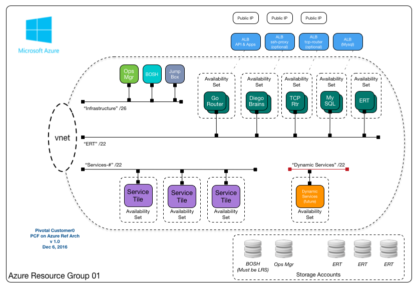

#Pivotal Customer0 Azure Reference Architecture

Summary: Customer0 Reference Architectures are utilized by Pivotal's Customer0 group to simulate a base deployment of our products that is common to as many customer use cases as possible. These architectures are then automated via concourse pipelines and 'validated' thru various Customer0 validation scenarios to simulate common customer use cases.

This PCF on GCP reference architecture is published as is with no warranty or support expressed or implied.

Validation Key Info (STATUS=Draft WIP)

| PCF Products Validated        | Version                   |
| ----------------------------- |:-------------------------:|
| PCF Ops Manager               | 1.8.latest |
| Elastic Runtime               | 1.8.latest                |

### Pivotal Customer0 Reference Architecture Overview

  

This model shows a single PCF deployment in a single Azure Resource Group. For HA deployment, create and deploy same on a second Resource Group.

The reference approach is to create a Resource Group, populate it with a virtual network and draw three subnets from it. These three subnets will be used in a manner similar to other Customer[0] architectures, where one is used for infrastructure, one for apps and one for service tiles.

### IaaS Architecture

In Azure, you will need some architectural constructs to deploy products in:
  - (1) Service Principal account in a Azure Active Directory (ADD) application for BOSH to use to deploy PCF with [here](http://docs-pcf-review.cfapps.io/pivotalcf/1-8/customizing/azure-prepare-env.html)
  - (1) Resource Group per PCF installation. Duplicate this for for HA.
  - (\*) Availability Sets created by BOSH for each deployment job type
  - (1) Virtual Network (vnet) with a large range of address space that will be sub-divided
    - Example: 10.xxx.yyy.0/20
      - (1) Infra 10.xxx.yyy.0/26
      - (1) ERT 10.xxx.yyy.0/22
      - (1) Services-# 10.xxx.yyy.0/22
    - Note that a subnet is a logical component of a single Virtual Network.
  - (\*) Network Security Groups (NSGs) - one or more to meet security requirements, firewall rules that apply to network interfaces
  - (3) Azure Load Balancers (ALBs)
    - (1) Public app access
    - (1) Internal use, for example MySQL
    - Optional (1) TCP Routers, if option is selected
  - (4) Standard Storage Accounts to match deployment needs (\*see caveats)
    - (1) Ops Manager + BOSH
    - (3) ERT and other tile deployments
  - (1) Jump Box on the Infra network to provide CLI tools
  - (1 - 4) Public IPs
    - (1) VIP for ALB for CF domains (sys. and apps.)
    - Optional (1) VIP for ALB to TCP Routers
    - Optional (1) SSH into jump box
    - Optional (1) HTTPS Ops Manager

### Network Topology

  ![]Image

  - NSGs
    - [here](http://docs-pcf-review.cfapps.io/pivotalcf/1-8/customizing/azure-om-deploy.html)
  - Application Security Groups
  - Load Balancer Topology
  - Private RFC versus Public IP Addresses
  - IaaS Specific VPN Architecture (Express Route/Home Grown VPN)
  - Azure API Manager * (Optional)
  - GSLB Setup * (Optional)

### Caveats and Concerns

Azure Storage Accounts have an IOPs limit (20k, per) which generally relates to a VM limit of 20 VMs per (safely). Consumers aren't charged by the Storage Account but rather by consumption. Size your deployments accordingly.

A practical jump box inside your Azure deployment can be very useful. A Linux VM with a number of useful CLIs pre-installed is recommended:

  1. Azure CLI
  2. BOSH CLI
  3. Pivotal enaml & omg CLI
  4. traceroute
  5. netsec
  6. getmap

Customer[0] curates a Slack channel for the Azure community at Pivotal. Visit http://pivotal.slack.com/customer0-azure for join.

#Pivotal Customer0 Deployment Pipeline

Describe what Customer0 Uses the pipeline for (Solution Validation)
[Insert Link to pipeline repo]


- Document How to use the pipeline in a POC scenario
- Document How to ref the pipeline for manual deployment steps
- Document What Customer0 Validates * (Future link to validation repos)


```
Links to Relevant Code
```
