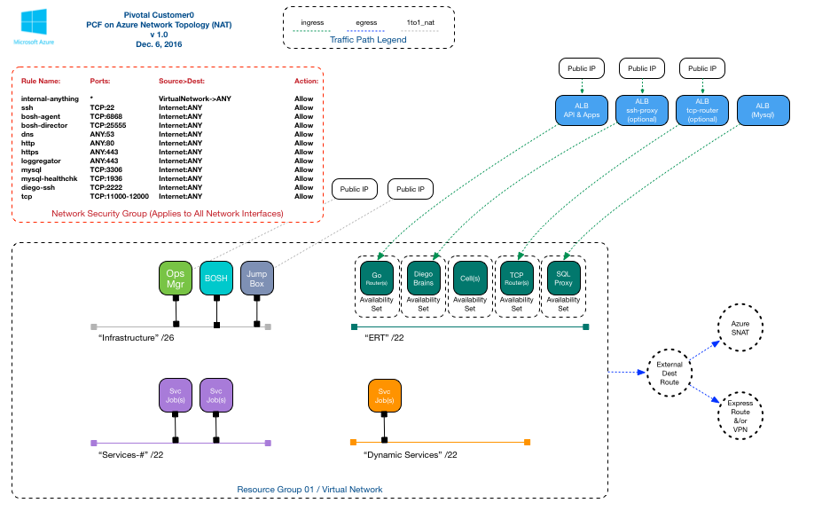

#Pivotal Customer0 Azure Reference Architecture

__Summary__: Customer0 Reference Architectures are utilized by Pivotal's Customer0 group to simulate a base deployment of our products that is common to as many customer use cases as possible. These architectures are then automated via concourse pipelines and 'validated' thru various Customer0 validation scenarios to simulate common customer use cases.

This PCF on GCP reference architecture is published as is with no warranty or support expressed or implied.

Validation Key Info (STATUS=Draft WIP)

| PCF Products Validated        | Version                   |
| ----------------------------- |:-------------------------:|
| PCF Ops Manager               | 1.8.latest |
| Elastic Runtime               | 1.8.latest                |

### Pivotal Customer0 Reference Architecture Overview

  

  - [Pipeline Repo Link](https://github.com/c0-ops/azure-concourse) : Customer0 Concourse Pipelines
  - [Pipeline ERT Repo Link](https://github.com/c0-ops/ert-concourse) : Customer0 Concourse Pipelines
  - [Running Pipeline Link](https://fly.customer0.net/teams/main/pipelines/azure-base) : See the Running Customer0 Concourse Pipelines

This model shows a single PCF deployment in a single Azure Resource Group. HA deployments can be achieved by creating and same topology in an additional Resource Group and globally load balancing across them (GSLB).

The reference approach is to create a single Resource Group, populate it with the required Azure constructs and then deploy PCF with Pivotal Operations Manager.  Core networking is created via an Azure virtual network with the following subnets:
  - Infrastructure
  - ERT (_Elastic Runtime_)
  - Service tiles
  - Dynamic Service tiles

### IaaS Architecture

In Azure, you will need some architectural constructs to deploy PCF:

  - (1) Service Principal Account in a Azure Active Directory (ADD) application for BOSH to use to deploy PCF with.  Documentation for creating the Service Principal can be found  [here](http://docs.pivotal.io/pivotalcf/1-8/customizing/azure-prepare-env.html)
  - (1) Resource Group per PCF installation.
  - (\*) Availability Sets created by BOSH for each deployment job type
  - (1) Virtual Network (vnet) with a large range of address space that will be sub-divided
    - Example: 10.xxx.yyy.0/20
      - (1) Infra 10.xxx.yyy.0/26
      - (1) ERT 10.xxx.yyy.0/22
      - (1) Services-# 10.xxx.yyy.0/22
      - (1) Dynamic Service-# 10.xxx.yyy.0/22

     **Note that a subnet is a logical component bound to a single Virtual Network and must exist in the the same Resource Group**

  - (1) Network Security Group (NSG) - to meet security requirements, firewall rules that apply to network interfaces (_Ops Manager for Azure currently limits to 1 security group_)
  - (4) Azure Load Balancers (ALBs)
    - (1) Public app access for API and Apps
    - (1) Internal use, for example MySQL
    - Optional (1) TCP Routers, if option is selected
    - Optional (1) SSH Proxy
  - (5) Standard Storage Accounts to match deployment needs (\*see caveats)
    - (1) Ops Manager
    - (1) BOSH
    - (3) ERT and other tile deployments
  - (1) Jump Box on the Infra network to provide CLI tools
  - (1 - 5) Public IPs
    - (1) VIP for ALB for CF domains (sys. and apps.)
    - (1) SSH into jump box
    - Optional (1) VIP for ALB to TCP Routers
    - Optional (1) HTTPS Ops Manager
    - Optional (1) SSH Proxy to Diego Brains

**NOTE: Public IP's are required iff not deploying with a VPN or Express Route Solution**

### Network Topology
_This section is currently in Progress_

  - NSGs
    - Documentaion for creating NSGs can found [here](http://docs.pivotal.io/pivotalcf/1-8/customizing/azure-om-deploy.html)
  - Application Security Groups
    - _Doc in Progress_
  - Azure Load Balancer Topology
    - HAProxy Job is not recommended for a production deployment, instead use a highly-available azure-provided load balancing solution. For more information look [here](http://docs.pivotal.io/pivotalcf/1-8/opsguide/ssl-term-haproxy.html)
  - IaaS Specific VPN Architecture (Express Route/Home Grown VPN)
    - _Doc in Progress_
  - Azure API Manager * (Optional)
     - _Doc in Progress_
  - GSLB Setup * (Optional)
     - _Doc in Progress_

### Caveats and Concerns

Azure Storage Accounts have an IOPs limit (20k, per) which generally relates to a VM limit of 20 VMs per (safely). Consumers aren't charged by the Standard Storage Account but rather by consumption. Size your deployments accordingly.

A practical jump box inside your Azure deployment can be very useful. A Linux VM with a number of useful CLIs pre-installed is recommended:

  1. Azure CLI (node.js dependent)
  2. BOSH CLI
<<<<<<< HEAD
  3. Pivotal Customer[0] enaml & omg CLI
  4. traceroute
  5. nmap
=======
  3. CFOps
  4. UAA CLI
  5. traceroute
  6. netsec
  7. getmap
  8. CF CLI
>>>>>>> 9c78b1139f7dbde8dd4d14832ef47c6be04b887d

Customer[0] curates a Slack channel for the Azure community at Pivotal. Visit http://pivotal.slack.com/customer0-azure for join.
