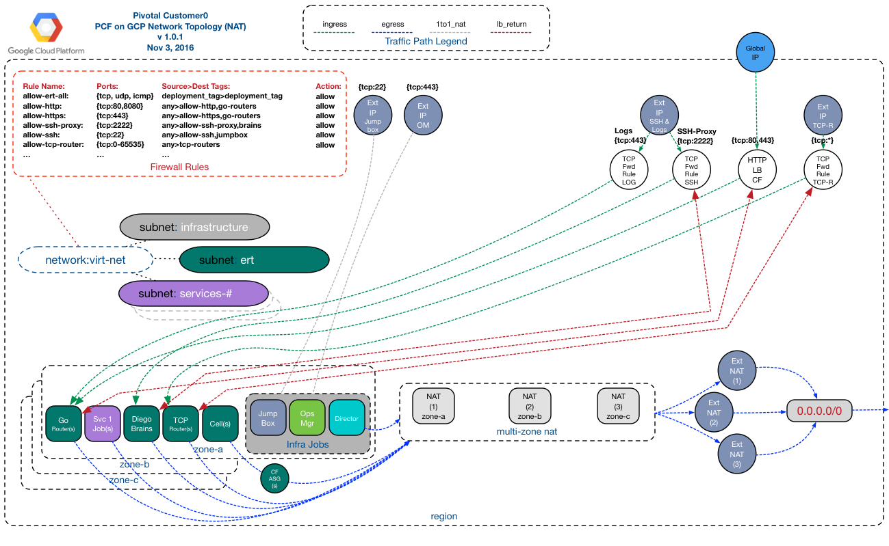

#Pivotal Customer0 _PCF on GCP_ Reference Architecture

*__Goal__*:  Customer0 Reference Architectures are utilized by Pivotal's Customer0 group to _simulate_ a base deployment of our products that is common to as many customer use cases as possible.  These architectures are then automated via concourse pipelines and _'validated'_ thru various customer0 validation scenarios to simulate typical customer use cases.

######* Customer0[Typical Customer] * = _A secured but publicly accessible PCF Foundation, capable of hosting ~100 Application instances with PCF managed Services: "Mysql, RabbitMQ, Pivotal Spring Cloud Services"_

*__Non-Goals__*:

- This PCF on GCP reference architecture is published as is with no warranty or support expressed or implied!.
- This document is NOT intended to replace basic installation documentation located @ [http://docs.pivotal.io/pivotalcf/1-8/customizing/gcp.html](http://docs.pivotal.io/pivotalcf/1-8/customizing/gcp.html), but rather to demonstrate how those instructions should be related to a typical/recommended Pivotal Cloud Foundry Installation.

*__Validation Key Info__*: (STATUS=Not Yet Passing C0 Validation)

| PCF Products Validated        | Version                   | Known Issues              |
| -----------------------------:|-------------------------:|:-------------------------|
| PCF Ops Manager               | 1.8.9 (OCT 26 2016) | PASS |
| Elastic Runtime               | 1.8.10 (OCT 26 2016) | 1.8.# ERT, Ops Manager places Routers in AZ3 to incorrect GCP backend.  AZ1 & AZ2 OK & smoke tests passing
| Rabbit                        | 1.7.# (Latest) | NOT YET VALIDATED |
| Metrics                       | 1.1.# (Latest) | NOT YET VALIDATED |
| Mysql                         | 1.7.# (Latest) | NOT YET VALIDATED |
| Spring Cloud Services         | 1.2.# (Latest) | NOT YET VALIDATED |

## Reference Architecture IaaS Overview

PCF on GCP Reference Architecture Overview (*c0-gcp-base*):

- [Pipeline Repo Link](https://github.com/c0-ops/gcp-concourse) : Customer0 Concourse Pipelines
- [Running Pipeline Link](https://fly.customer0.net/teams/main/pipelines/c0-gcp-deploy-ert-base) : See the Running Customer0 Concourse Pipelines


###__PCF on GCP requires the following GCP Components__:

##### Project/Region/Zones

A Cloud Foundry Deployment will exist within a single Project.  It will be located in a single GCP region and should distribute Cloud Foundry Jobs/Instances across 3 GCP zones to ensure a high degree of availability.  Each GCP Zone will map to a Cloud Foundry Availability Zone

##### Google Cloud API

Pivotal Ops Manager & BOSH will utilize the Google Compute Engine API, it must be enabled on a new Google Cloud subscription as it is not enabled by default


#####Quotas

Default quotas on a new GCP subscription will not have enough quota for a typical PCF deployment.  This Reference Architecture has been sized to host ~300 typical Cloud Foundry AIs.   You should request a Quota increase for the following Objects:

| Resource        | Suggested Limit                   |
| ----------------------------- |:-------------------------:|
| CPUs *Region Specific*		|#|
| Firewall Rules				   |#|
| Forwarding Rules				   |#|
| Health Checks				   |#|
| Images				   |#|
| Static IP Addresses *Region Specific*   |#|
| IP Addresses Global				   |#|
| IP Addresses *Region Specific*		|#|
| Networks *Region Specific*		|#|
| Subnetworks		|#|
| Routes		|#|
| Target Pools		|#|
| Total persistent disk reserved (GB) *Region Specific* |#|

#####Service Accounts
#####Networks
- Subnets 
- Routes
- External IPs

#####FireWall Rules
#####Load Balancing
- Forwarding Rules
- Target Pools
- Health Checks
 
#####Instance Groups
#####Images

## Network Topology

PCF on GCP Base Network Topology (*c0-gcp-base*):

Explain Base Network Architecture & GCP Objects

  - Recommended Firewall Topology with Tags
  - GCP Project SSH Topology
  - Application Security Groups
  - Load Balancer Topology
    - 	TCP
    -  HTTPS

## Variants to Reference Architecture

Will Variant Image(s) here:

Customer0 will 'validate' a limited number of variant scenarios from the base tolopology.

| Variant *{{gcp_pcf_terraform_template}}*| Varient Description                   |
| -----------------------------:|:-------------------------|
|c0-gcp-nonat|Base template + No dedicated SNAT, default GCP instances each with Public IPs for SNAT| 
|c0-gcp-private|Base template - All External IPs, no public IPs at all||
|c0-gcp-ipsec|Base template + IPSEC add on||
|c0-gcp-gslb|2 x Base templates deployments Globally load balanced||

  

##Pivotal Customer0 PCF on GCP Deployment Pipeline

Describe what Customer0 Uses the pipeline for (Solution Validation)
[Insert Link to pipeline repo]

Min-Reqs to run the Pipleine ...

1. Appropriate GCP Quotas
2. [GCP Service Account](http://docs.pivotal.io/pivotalcf/1-8/customizing/gcp-prepare-env.html#iam_account)
3. [Enable GCP APIs](http://docs.pivotal.io/pivotalcf/1-8/customizing/gcp-prepare-env.html#enable_compute_resource_api)
4. A resolvable/registered DNS domain for Cloud Foundry `system` & `apps` domains
5. A [Concourse](https://concourse.ci/) instance with workers that have public access.

(ToDo) Document How to use the pipeline in a POC scenario ...

(ToDo) Document How to ref the pipeline for manual deployment steps ...

(ToDo) Document What Customer0 Validates * (Future html link to validation repos) ...

Pipeline Job/Tasks
```
Links to Relevant Pipeline Code
```

Pipeline Job/Tasks
```
Links to Relevant Pipeline Code
```

##PCF on GCP Helpful Links

- [https://cloud.google.com/solutions/cloud-foundry-on-gcp](https://cloud.google.com/solutions/cloud-foundry-on-gcp)
- [http://docs.pivotal.io/pivotalcf/1-8/customizing/gcp.html](http://docs.pivotal.io/pivotalcf/1-8/customizing/gcp.html)
- [https://github.com/cloudfoundry-incubator/bosh-google-cpi-release](https://github.com/cloudfoundry-incubator/bosh-google-cpi-release)
- [http://bosh.io/stemcells/bosh-google-kvm-ubuntu-trusty-go_agent](http://bosh.io/stemcells/bosh-google-kvm-ubuntu-trusty-go_agent)
- [http://bosh.io/releases/github.com/cloudfoundry-incubator/bosh-google-cpi-release?all=1](http://bosh.io/releases/github.com/cloudfoundry-incubator/bosh-google-cpi-release?all=1)